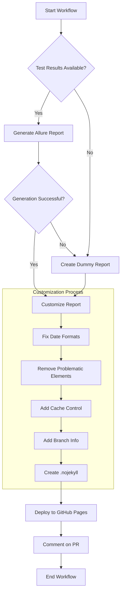

# Allure Report Customization Flow

This document visualizes how the Allure report customization process works in our CI/CD pipeline.

## Process Flow

## Components

### Input
- **Test Results**: XML files in Allure format from pytest with allure plugin
- **Branch Information**: Detected from git or environment variables
- **Template Files**: HTML, CSS, and JavaScript templates used for customization

### Customization Steps
1. **Fix Date Formats**:
   - Standardizes all dates to DD-MM-YYYY format
   - Updates HTML title tags, JavaScript strings, and JSON timestamps

2. **Remove Problematic Elements**:
   - Removes meta refresh tags that cause loading issues
   - Adds CSS to fix spinner animations

3. **Add Cache Control**:
   - Adds HTTP headers to prevent caching
   - Adds meta tags to HTML files

4. **Add Branch Info**:
   - Updates environment.properties with branch name
   - Injects JavaScript to position branch info at the top of environment table

5. **Create .nojekyll**:
   - Ensures GitHub Pages doesn't process the files with Jekyll

### Output
- **Customized Allure Report**: Clean, properly formatted HTML report with consistent date formats and branch information
- **GitHub Pages Site**: Deployed report accessible via GitHub Pages
- **PR Comment**: Links to the reports added to Pull Requests

## Files Involved

| File | Purpose |
|------|---------|
| customize_allure_report.py | Main script for report customization |
| templates/dummy_report.html | Template for dummy report |
| templates/cache_headers.html | Cache control header template |
| templates/spinner_fix.css | CSS template for fixing spinners |
| js/date_formatter.js | JavaScript for dynamic date formatting |
| js/branch_position.js | JavaScript for branch info positioning |
| js/inline_date_formatter.js | JavaScript for inline date formatting | 