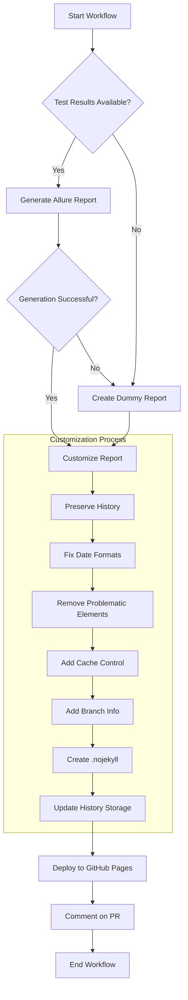

# Allure Report Customization Flow

This document visualizes how the Allure report customization process works in our CI/CD pipeline.

## Process Flow

## Components

### Input
- **Test Results**: XML files in Allure format from pytest with allure plugin
- **Branch Information**: Detected from git or environment variables
- **Template Files**: HTML, CSS, and JavaScript templates used for customization
- **History Storage**: Previous test run history data preserved as artifacts

### Customization Steps
1. **Preserve History**:
   - Checks for existing history in storage
   - Copies previous history to current report directory
   - Used by Allure to generate trends and statistics

2. **Fix Date Formats**:
   - Standardizes all dates to DD-MM-YYYY format
   - Updates HTML title tags, JavaScript strings, and JSON timestamps

3. **Remove Problematic Elements**:
   - Removes meta refresh tags that cause loading issues
   - Adds CSS to fix spinner animations

4. **Add Cache Control**:
   - Adds HTTP headers to prevent caching
   - Adds meta tags to HTML files

5. **Add Branch Info**:
   - Updates environment.properties with branch name
   - Injects JavaScript to position branch info at the top of environment table

6. **Create .nojekyll**:
   - Ensures GitHub Pages doesn't process the files with Jekyll

7. **Update History Storage**:
   - Saves the latest history data to artifact storage
   - Maintains test execution history between 30-90 days depending on settings

### Output
- **Customized Allure Report**: Clean, properly formatted HTML report with consistent date formats, branch information, and historical trends
- **History Data**: Preserved test execution history to generate trends
- **GitHub Pages Site**: Deployed report accessible via GitHub Pages
- **PR Comment**: Links to the reports added to Pull Requests

## Test History Features

The history preservation feature adds the following to your Allure reports:

1. **Trend Charts**: Shows pass/fail rates over time
2. **Duration Trends**: Tracks how test execution time changes between runs
3. **Flaky Test Detection**: Identifies tests that alternate between pass/fail states
4. **Stability Metrics**: Shows the overall stability of your test suite
5. **Regression Spotting**: Helps identify when tests start failing after previously passing

The history data is stored as a GitHub Actions artifact named `allure-history` with a 90-day retention period, allowing you to track trends over multiple months.

## Files Involved

| File | Purpose |
|------|---------|
| customize_allure_report.py | Main script for report customization |
| templates/dummy_report.html | Template for dummy report |
| templates/cache_headers.html | Cache control header template |
| templates/spinner_fix.css | CSS template for fixing spinners |
| js/date_formatter.js | JavaScript for dynamic date formatting |
| js/branch_position.js | JavaScript for branch info positioning |
| js/inline_date_formatter.js | JavaScript for inline date formatting |
| reports/allure-history/ | Storage directory for test execution history | 